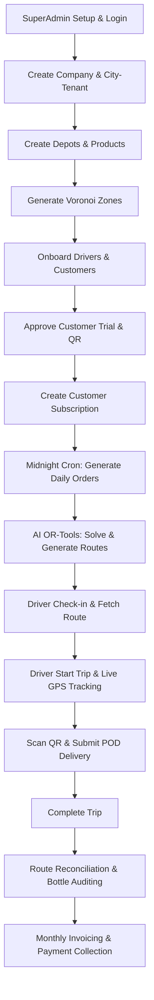

# 🚀 Pench ERP: Complete End-to-End API Flow Documentation

This document provides a step-by-step guide to every API across the **Pench Logistics ERP** ecosystem. Each step details the HTTP method, endpoint URL, headers, JSON/multipart request payload, expected response, and which Postman/environment variables to capture.

---

## 📑 Table of Contents
1. [Environment & Host Architecture](#1-environment--host-architecture)
2. [Phase 1: Global Platform & Multi-Tenant Setup (Public Schema)](#phase-1-global-platform--multi-tenant-setup-public-schema)
3. [Phase 2: Authentication, Roles & Profiles (Public Schema)](#phase-2-authentication-roles--profiles-public-schema)
4. [Phase 3: City Infrastructure & Depot Setup (Tenant Schema)](#phase-3-city-infrastructure--depot-setup-tenant-schema)
5. [Phase 4: Product Catalog, Bottle Inventory & Warehousing (Tenant Schema)](#phase-4-product-catalog-bottle-inventory--warehousing-tenant-schema)
6. [Phase 5: Fleet & Driver Onboarding (Tenant Schema)](#phase-5-fleet--driver-onboarding-tenant-schema)
7. [Phase 6: Customer CRM, Onboarding & Geofencing (Tenant Schema)](#phase-6-customer-crm-onboarding--geofencing-tenant-schema)
8. [Phase 7: Subscriptions Management (Tenant Schema)](#phase-7-subscriptions-management-tenant-schema)
9. [Phase 8: Order Generation & Automated Dispatch (Tenant Schema)](#phase-8-order-generation--automated-dispatch-tenant-schema)
10. [Phase 9: AI Route Optimization & Trip Scheduling (Tenant Schema)](#phase-9-ai-route-optimization--trip-scheduling-tenant-schema)
11. [Phase 10: Driver Mobile App Execution Flow (Tenant Schema)](#phase-10-driver-mobile-app-execution-flow-tenant-schema)
12. [Phase 11: Real-Time Live Tracking & WebSockets (Tenant Schema)](#phase-11-real-time-live-tracking--websockets-tenant-schema)
13. [Phase 12: Route Reconciliation & Inventory Auditing (Tenant Schema)](#phase-12-route-reconciliation--inventory-auditing-tenant-schema)
14. [Phase 13: Taxation, Invoicing & Billing (Tenant Schema)](#phase-13-taxation-invoicing--billing-tenant-schema)
15. [Phase 14: Push & In-App Notifications (Tenant Schema)](#phase-14-push--in-app-notifications-tenant-schema)

---

## 1. Environment & Host Architecture

Pench ERP operates on a multi-tenant PostgreSQL schema architecture:
- **Public Schema (`{{base_url}}`)**: Handles global routing, superusers, companies, and tenant city creation.
  - Local Dev: `http://localhost:8000`
  - Production: `https://pench.api.polynexus.in`
- **Tenant City Schema (`{{city_url}}`)**: Handles all localized operational data (orders, inventory, customers, routes, billing).
  - Local Dev: `http://nagpur.localhost:8000`
  - Production: `https://nagpur.pench.api.polynexus.in`
- **WebSocket Protocol (`{{ws_url}}`)**: Real-time vehicle telematics.
  - Local Dev: `ws://nagpur.localhost:8000`
  - Production: `wss://nagpur.pench.api.polynexus.in`

---

## Phase 1: Global Platform & Multi-Tenant Setup (Public Schema)
*Host: `{{base_url}}`*

### 1.1 Register SuperAdmin Account
- **Endpoint**: `POST {{base_url}}/api/accounts/register/`
- **Headers**:
  ```http
  Content-Type: application/json
  ```
- **Payload**:
  ```json
  {
      "username": "superadmin",
      "password": "password123",
      "email": "super@penchfoods.com",
      "phone": "9100000001",
      "first_name": "Super",
      "last_name": "Admin",
      "role": "SuperAdmin",
      "is_erp_user": true
  }
  ```
- **Response** `(201 Created)`:
  ```json
  {
      "id": "a1b2c3d4-0001-4000-8000-000000000001",
      "username": "superadmin",
      "role": "SuperAdmin"
  }
  ```

### 1.2 Login as SuperAdmin
- **Endpoint**: `POST {{base_url}}/api/accounts/login/`
- **Headers**:
  ```http
  Content-Type: application/json
  ```
- **Payload**:
  ```json
  {
      "username": "superadmin",
      "password": "password123"
  }
  ```
- **Response** `(200 OK)`:
  ```json
  {
      "access": "eyJhbGciOi...",
      "refresh": "eyJhbGciOi...",
      "user": {
          "id": "a1b2c3d4-0001-4000-8000-000000000001",
          "username": "superadmin",
          "role": "SuperAdmin"
      }
  }
  ```
  *(Save `access` to `{{access_token}}`)*

### 1.3 Create Corporate Company
- **Endpoint**: `POST {{base_url}}/api/erp/tenants/companies/`
- **Headers**:
  ```http
  Authorization: Bearer {{access_token}}
  Content-Type: application/json
  ```
- **Payload**:
  ```json
  {
      "name": "Pench Foods Pvt Ltd",
      "code": "PENCH"
  }
  ```
- **Response** `(201 Created)`:
  ```json
  {
      "id": "e8a1d7f3-1000-4000-8000-000000000001",
      "name": "Pench Foods Pvt Ltd",
      "code": "PENCH"
  }
  ```
  *(Save `id` to `{{company_id}}`)*

### 1.4 Create City Tenant (Triggers Schema Creation & Domain Mapping)
- **Endpoint**: `POST {{base_url}}/api/erp/tenants/cities/`
- **Headers**:
  ```http
  Authorization: Bearer {{access_token}}
  Content-Type: application/json
  ```
- **Payload**:
  ```json
  {
      "company": "{{company_id}}",
      "name": "Nagpur",
      "state": "Maharashtra",
      "code": "NGP",
      "timezone": "Asia/Kolkata",
      "require_pod": true
  }
  ```
- **Response** `(201 Created)`:
  ```json
  {
      "id": "c7f9d8a1-2000-4000-8000-000000000001",
      "name": "Nagpur",
      "schema_name": "nagpur",
      "domain_url": "nagpur.localhost"
  }
  ```
  *(Save `id` to `{{city_id}}`)*

---

## Phase 2: Authentication, Roles & Profiles (Public Schema)
*Host: `{{base_url}}`*

### 2.1 Register Staff User
- **Endpoint**: `POST {{base_url}}/api/accounts/register/`
- **Payload**:
  ```json
  {
      "username": "staffuser",
      "password": "password123",
      "email": "staff@penchfoods.com",
      "phone": "9100000002",
      "first_name": "Staff",
      "last_name": "Member",
      "role": "Staff",
      "is_erp_user": true,
      "tenant_schema": "nagpur"
  }
  ```

### 2.2 Register City Operations Manager
- **Endpoint**: `POST {{base_url}}/api/accounts/register/`
- **Payload**:
  ```json
  {
      "username": "manageruser",
      "password": "password123",
      "email": "manager@penchfoods.com",
      "phone": "9100000003",
      "first_name": "Manager",
      "last_name": "User",
      "role": "Manager",
      "is_erp_user": true,
      "tenant_schema": "nagpur"
  }
  ```

### 2.3 Register Driver User Account
- **Endpoint**: `POST {{base_url}}/api/accounts/register/`
- **Payload**:
  ```json
  {
      "username": "driver_pratham",
      "password": "password123",
      "email": "pratham.driver@penchfoods.com",
      "phone": "9876543210",
      "first_name": "Pratham",
      "last_name": "Rao",
      "role": "Drivers",
      "is_driver": true,
      "tenant_schema": "nagpur"
  }
  ```
  *(Save returned user `id` to `{{driver_user_id}}`)*

### 2.4 Register Customer User Account
- **Endpoint**: `POST {{base_url}}/api/accounts/register/`
- **Payload**:
  ```json
  {
      "username": "aniket_customer",
      "password": "password123",
      "email": "aniket@example.com",
      "phone": "9822001122",
      "first_name": "Aniket",
      "last_name": "Sharma",
      "role": "Customers",
      "tenant_schema": "nagpur"
  }
  ```
  *(Save returned user `id` to `{{customer_user_id}}`)*

### 2.5 Phone OTP Login Flow (Alternative for Mobile Apps)
1. **Request OTP**:
   - `POST {{base_url}}/api/accounts/request-otp/`
   - Payload: `{"phone": "9822001122"}`
2. **Verify OTP & Login**:
   - `POST {{base_url}}/api/accounts/login-otp/`
   - Payload: `{"phone": "9822001122", "code": "123456"}`

---

## Phase 3: City Infrastructure & Depot Setup (Tenant Schema)
*Host: `{{city_url}}` (`http://nagpur.localhost:8000`)*

### 3.1 Create Delivery Zone (Manual Polygon or Centerpoint)
- **Endpoint**: `POST {{city_url}}/api/ems/zones/` (or `{{city_url}}/api/erp/tenants/zones/`)
- **Headers**:
  ```http
  Authorization: Bearer {{access_token}}
  Content-Type: application/json
  ```
- **Payload**:
  ```json
  {
      "name": "Dharampeth Zone",
      "code": "DP-01",
      "description": "Dharampeth, Ram Nagar, Shivaji Nagar",
      "is_active": true,
      "boundary": {
          "type": "Polygon",
          "coordinates": [
              [
                  [79.0500, 21.1300],
                  [79.0800, 21.1300],
                  [79.0800, 21.1600],
                  [79.0500, 21.1600],
                  [79.0500, 21.1300]
              ]
          ]
      }
  }
  ```
- **Response** `(201 Created)`:
  ```json
  {
      "id": "z1e2d3c4-3000-4000-8000-000000000001",
      "name": "Dharampeth Zone"
  }
  ```
  *(Save `id` to `{{zone_id}}`)*

### 3.2 Automated Voronoi Zone Generation (Bulk from Customer Excel)
- **Endpoint**: `POST {{city_url}}/api/ems/zones/generate-from-excel/`
- **Headers**:
  ```http
  Authorization: Bearer {{access_token}}
  Content-Type: multipart/form-data
  ```
- **Form Data**:
  - `file`: `[Upload customer_dataset.xlsx]`
- **Description**: Reads customer coordinates and driver clusters, builds optimal non-overlapping Voronoi delivery zones clipped to city boundaries, and auto-assigns existing customers.

---

## Phase 4: Product Catalog, Bottle Inventory & Warehousing (Tenant Schema)
*Host: `{{city_url}}`*

### 4.1 Create Depot / Warehouse
- **Endpoint**: `POST {{city_url}}/api/erp/inventory/warehouses/`
- **Headers**:
  ```http
  Authorization: Bearer {{access_token}}
  Content-Type: application/json
  ```
- **Payload**:
  ```json
  {
      "name": "Nagpur Central Depot",
      "code": "NGP-WH-01",
      "address": "Ghat Road, Nagpur",
      "latitude": 21.1458,
      "longitude": 79.0882
  }
  ```
  *(Save `id` to `{{warehouse_id}}`)*

### 4.2 Create Dairy Product
- **Endpoint**: `POST {{city_url}}/api/erp/inventory/products/`
- **Payload**:
  ```json
  {
      "name": "A2 Cow Milk (1 Litre Glass Bottle)",
      "sku": "MILK-A2-1L",
      "unit_price": 90.00,
      "unit": "litre",
      "is_active": true,
      "description": "Fresh Farm Pure A2 Milk in Reusable Glass Bottle"
  }
  ```
  *(Save `id` to `{{product_id}}`)*

### 4.3 Initialize Stock Levels at Depot
- **Endpoint**: `POST {{city_url}}/api/erp/inventory/stock/`
- **Payload**:
  ```json
  {
      "warehouse": "{{warehouse_id}}",
      "product": "{{product_id}}",
      "quantity": 1000
  }
  ```

---

## Phase 5: Fleet & Driver Onboarding (Tenant Schema)
*Host: `{{city_url}}`*

### 5.1 Create Driver Profile
- **Endpoint**: `POST {{city_url}}/api/ems/drivers/`
- **Headers**:
  ```http
  Authorization: Bearer {{access_token}}
  Content-Type: application/json
  ```
- **Payload**:
  ```json
  {
      "user": "{{driver_user_id}}",
      "zone": "{{zone_id}}",
      "vehicle_plate": "MH-31-AZ-9988",
      "vehicle_type": "Mini Van",
      "max_capacity_kg": 500,
      "is_available": true
  }
  ```
- **Response** `(201 Created)`:
  ```json
  {
      "id": "d9e8f7a6-4000-4000-8000-000000000001",
      "user": "{{driver_user_id}}",
      "vehicle_plate": "MH-31-AZ-9988"
  }
  ```
  *(Save `id` to `{{driver_profile_id}}`)*

---

## Phase 6: Customer CRM, Onboarding & Geofencing (Tenant Schema)
*Host: `{{city_url}}`*

### 6.1 Create Customer Record
- **Endpoint**: `POST {{city_url}}/api/erp/customers/`
- **Headers**:
  ```http
  Authorization: Bearer {{access_token}}
  Content-Type: application/json
  ```
- **Payload**:
  ```json
  {
      "name": "Aniket Sharma",
      "company": "Home Delivery",
      "email": "aniket@example.com",
      "phone": "9822001122",
      "address": "Flat 402, Gokul Heights, Dharampeth, Nagpur",
      "location": {
          "latitude": 21.1458,
          "longitude": 79.0882
      },
      "user": "{{customer_user_id}}",
      "zone": "{{zone_id}}",
      "is_active": true,
      "is_new": true,
      "trial_approved": false
  }
  ```
- **Response** `(201 Created)`:
  ```json
  {
      "id": "c1a2b3d4-5000-4000-8000-000000000001",
      "name": "Aniket Sharma",
      "qr_code_id": "c4ed832a-4844-42ed-8519-d205283f3b8d",
      "zone": "{{zone_id}}"
  }
  ```
  *(Save `id` to `{{customer_profile_id}}` and `qr_code_id` to `{{qr_id}}`)*

### 6.2 Approve Customer Trial & Sample Bottle
- **Endpoint**: `POST {{city_url}}/api/erp/customers/{{customer_profile_id}}/approve/`
- **Headers**: `Authorization: Bearer {{access_token}}`
- **Payload**: `{}`
- **Action**: Approves trial delivery status, marks customer as eligible for demo dispatch.

### 6.3 Customer QR Management
- **View Customer QR**:
  - `GET {{city_url}}/api/erp/customers/{{customer_profile_id}}/view-qr/`
- **Download Printable Sticker Label (PNG/PDF)**:
  - `GET {{city_url}}/api/erp/customers/{{customer_profile_id}}/download-qr/`
- **Bulk Download QR Sticker Sheets**:
  - `GET {{city_url}}/api/erp/customers/bulk-download-qr/?ids={{customer_profile_id}}`

---

## Phase 7: Subscriptions Management (Tenant Schema)
*Host: `{{city_url}}`*

### 7.1 Create Daily / Custom Subscription
- **Endpoint**: `POST {{city_url}}/api/erp/subscriptions/`
- **Headers**:
  ```http
  Authorization: Bearer {{access_token}}
  Content-Type: application/json
  ```
- **Payload**:
  ```json
  {
      "customer": "{{customer_profile_id}}",
      "frequency": "daily",
      "start_date": "2026-05-20",
      "end_date": "2026-12-31",
      "status": "active",
      "items": [
          {
              "product": "{{product_id}}",
              "quantity": 2
          }
      ]
  }
  ```
- **Response** `(201 Created)`:
  ```json
  {
      "id": "s9a8b7c6-6000-4000-8000-000000000001",
      "customer": "{{customer_profile_id}}",
      "status": "active"
  }
  ```
  *(Save `id` to `{{subscription_id}}`)*

### 7.2 Subscription Controls (Pause, Resume, Cancel)
- **Pause Subscription**:
  - `POST {{city_url}}/api/erp/subscriptions/{{subscription_id}}/pause/`
  - Payload: `{"pause_start": "2026-06-01", "pause_end": "2026-06-07"}`
- **Resume Subscription**:
  - `POST {{city_url}}/api/erp/subscriptions/{{subscription_id}}/resume/`
  - Payload: `{}`
- **Cancel Subscription**:
  - `POST {{city_url}}/api/erp/subscriptions/{{subscription_id}}/cancel/`
  - Payload: `{"cancellation_reason": "Customer relocated"}`

---

## Phase 8: Order Generation & Automated Dispatch (Tenant Schema)
*Host: `{{city_url}}`*

### 8.1 Trigger Daily Order Generation
*Simulates midnight Celery Beat cron execution for a target delivery date.*
- **Endpoint**: `POST {{city_url}}/api/erp/subscriptions/trigger-generation/`
- **Headers**:
  ```http
  Authorization: Bearer {{access_token}}
  Content-Type: application/json
  ```
- **Payload**:
  ```json
  {
      "target_date": "2026-05-20"
  }
  ```
- **Response** `(200 OK)`:
  ```json
  {
      "status": "success",
      "date": "2026-05-20",
      "orders_created": 150
  }
  ```

### 8.2 Inspect Generated Orders
- **Endpoint**: `GET {{city_url}}/api/erp/orders/?delivery_date=2026-05-20`
- **Headers**: `Authorization: Bearer {{access_token}}`
- **Response** `(200 OK)`:
  *(Save one order `id` to `{{order_id}}`)*

---

## Phase 9: AI Route Optimization & Trip Scheduling (Tenant Schema)
*Host: `{{city_url}}`*

### 9.1 Generate Optimized Route via Google OR-Tools & OSRM
- **Endpoint**: `POST {{city_url}}/api/erp/orders/generate-routes/`
- **Headers**:
  ```http
  Authorization: Bearer {{access_token}}
  Content-Type: application/json
  ```
- **Payload**:
  ```json
  {
      "delivery_date": "2026-05-20",
      "zone_id": "{{zone_id}}",
      "depot_lat": 21.1458,
      "depot_lng": 79.0882
  }
  ```
- **Response** `(200 OK)`:
  ```json
  {
      "status": "success",
      "routes_created": 1,
      "routes": [
          {
              "id": "r1e2d3c4-7000-4000-8000-000000000001",
              "driver": "{{driver_profile_id}}",
              "total_orders": 35,
              "total_bottles": 70,
              "estimated_distance_km": 14.8,
              "estimated_duration_minutes": 75,
              "status": "pending"
          }
      ]
  }
  ```
  *(Save route `id` to `{{route_id}}`)*

---

## Phase 10: Driver Mobile App Execution Flow (Tenant Schema)
*Host: `{{city_url}}`*
*Authenticate as Driver: `POST /api/accounts/login/` with driver credentials to get `{{access_token}}`.*

### 10.1 Driver Morning Check-In
- **Endpoint**: `POST {{city_url}}/api/ems/drivers/check-in/`
- **Headers**:
  ```http
  Authorization: Bearer {{access_token}}
  Content-Type: application/json
  ```
- **Payload**:
  ```json
  {
      "vehicle_plate": "MH-31-AZ-9988",
      "vehicle_type": "Mini Van",
      "max_capacity_kg": 500,
      "zone": "{{zone_id}}"
  }
  ```

### 10.2 Fetch Assigned Route & Waypoints
- **Endpoint**: `GET {{city_url}}/api/erp/orders/driver/my-route/`
- **Headers**: `Authorization: Bearer {{access_token}}`
- **Response**: List of ordered customer delivery stops with drop sequence, navigation lat/long, bottle counts, and customer phone numbers.

### 10.3 Start Delivery Trip
- **Endpoint**: `POST {{city_url}}/api/erp/orders/driver/{{route_id}}/start-trip/`
- **Headers**: `Authorization: Bearer {{access_token}}`
- **Payload**: `{}`
- **Action**: Shifts route and orders from `PENDING` to `IN_TRANSIT`.

### 10.4 Scan Customer Doorstep QR Code
- **Endpoint**: `GET {{city_url}}/api/erp/orders/driver/resolve-qr/{{qr_id}}/`
- **Headers**: `Authorization: Bearer {{access_token}}`
- **Response** `(200 OK)`:
  ```json
  {
      "customer": {
          "id": "{{customer_profile_id}}",
          "name": "Aniket Sharma",
          "address": "Flat 402, Gokul Heights, Dharampeth"
      },
      "order": {
          "id": "{{order_id}}",
          "quantity": 2,
          "product_name": "A2 Cow Milk (1 Litre)",
          "status": "in_transit"
      }
  }
  ```

### 10.5 Submit Successful Delivery with POD & Empty Bottle Return
- **Endpoint**: `POST {{city_url}}/api/erp/orders/driver/{{order_id}}/submit-delivery/`
- **Headers**:
  ```http
  Authorization: Bearer {{access_token}}
  Content-Type: multipart/form-data
  ```
- **Form Data**:
  - `status`: `delivered`
  - `bottles_returned`: `2` *(int)*
  - `pod_image`: `[Upload Doorstep Photo / JPEG]`
  - `pod_latitude`: `21.1458`
  - `pod_longitude`: `79.0882`
- **Response** `(200 OK)`:
  ```json
  {
      "status": "delivered",
      "bottles_collected": 2,
      "message": "Delivery logged successfully"
  }
  ```

### 10.6 Submit Undelivered / Door Locked Exception
- **Endpoint**: `POST {{city_url}}/api/erp/orders/driver/{{order_id}}/submit-undelivered/`
- **Headers**:
  ```http
  Authorization: Bearer {{access_token}}
  Content-Type: multipart/form-data
  ```
- **Form Data**:
  - `reason`: `Door locked / No response`
  - `pod_image`: `[Upload Proof of Lock / JPEG]`
  - `pod_latitude`: `21.1458`
  - `pod_longitude`: `79.0882`

### 10.7 Complete Delivery Trip
- **Endpoint**: `POST {{city_url}}/api/erp/orders/driver/{{route_id}}/complete-trip/`
- **Headers**: `Authorization: Bearer {{access_token}}`
- **Payload**: `{}`
- **Action**: Marks Route status as `COMPLETED`.

---

## Phase 11: Real-Time Live Tracking & WebSockets (Tenant Schema)
*Host: `{{city_url}}` / `{{ws_url}}`*

### 11.1 Driver GPS Telemetry Ping (HTTP Fallback)
- **Endpoint**: `POST {{city_url}}/api/tracking/ping/`
- **Headers**:
  ```http
  Authorization: Bearer {{access_token}}
  Content-Type: application/json
  ```
- **Payload**:
  ```json
  {
      "latitude": 21.1459,
      "longitude": 79.0885,
      "speed": 24.5,
      "heading": 180.0
  }
  ```

### 11.2 WebSocket Live Driver Telematics (High-Frequency Stream)
- **Connect**: `ws://nagpur.localhost:8000/ws/tracking/?token={{access_token}}`
- **Send Frame** *(Driver App)*:
  ```json
  {
      "type": "location_update",
      "lat": 21.1460,
      "lng": 79.0890,
      "speed": 28.0,
      "battery": 88
  }
  ```
- **Receive Frame** *(Customer / Admin Dashboard)*:
  ```json
  {
      "driver_id": "{{driver_profile_id}}",
      "lat": 21.1460,
      "lng": 79.0890,
      "timestamp": 1748200000
  }
  ```

---

## Phase 12: Route Reconciliation & Inventory Auditing (Tenant Schema)
*Host: `{{city_url}}`*
*Authenticate as Admin/Manager.*

### 12.1 Generate Daily Route Reconciliation
- **Endpoint**: `POST {{city_url}}/api/erp/orders/routes/{{route_id}}/reconciliation/`
- **Headers**: `Authorization: Bearer {{access_token}}`
- **Payload**: `{}`
- **Response**: Audits planned vs actual delivered bottles, total empty bottles returned, cash collected, and fuel/km deviations.

### 12.2 Confirm & Close Reconciliation Record
- **Endpoint**: `POST {{city_url}}/api/erp/orders/reconciliations/`
- **Payload**:
  ```json
  {
      "route": "{{route_id}}",
      "bottles_delivered": 68,
      "bottles_returned": 64,
      "broken_bottles": 2,
      "cash_collected": 360.00,
      "is_approved": true,
      "reconciliation_notes": "2 bottles broken on transport, approved by supervisor."
  }
  ```

---

## Phase 13: Taxation, Invoicing & Billing (Tenant Schema)
*Host: `{{city_url}}`*

### 13.1 Configure City Tax Rates (GST / VAT)
- **Endpoint**: `POST {{city_url}}/api/erp/taxation/tax-rates/`
- **Payload**:
  ```json
  {
      "name": "Dairy GST 5%",
      "rate": 5.00,
      "is_active": true
  }
  ```

### 13.2 Generate Monthly Customer Invoices
- **Endpoint**: `POST {{city_url}}/api/erp/finance/bills/trigger-generation/`
- **Payload**:
  ```json
  {
      "year": 2026,
      "month": 5
  }
  ```
- **Response** `(200 OK)`: Computes delivered quantities, minus pauses, plus bottle deposits, creates consolidated Monthly Bill records with GST itemization.

### 13.3 Record Payment (Cash / Online / Razorpay)
- **Endpoint**: `POST {{city_url}}/api/erp/finance/payments/`
- **Payload**:
  ```json
  {
      "bill": "BILL_UUID_HERE",
      "customer": "{{customer_profile_id}}",
      "amount": 2700.00,
      "payment_method": "UPI",
      "transaction_reference": "UPI-IND-2026-998811",
      "status": "COMPLETED"
  }
  ```

---

## Phase 14: Push & In-App Notifications (Tenant Schema)
*Host: `{{city_url}}`*

### 14.1 Save Device FCM Token (Driver & Customer Mobile Apps)
- **Endpoint**: `POST {{city_url}}/api/notifications/save-token/`
- **Headers**:
  ```http
  Authorization: Bearer {{access_token}}
  Content-Type: application/json
  ```
- **Payload**:
  ```json
  {
      "token": "fcm_mobile_device_registration_token_here"
  }
  ```

### 14.2 List In-App Notifications
- **Endpoint**: `GET {{city_url}}/api/notifications/`
- **Headers**: `Authorization: Bearer {{access_token}}`

### 14.3 Mark In-App Notifications Read
- **Mark Single Notification Read**:
  - `POST {{city_url}}/api/notifications/{{notification_id}}/read/`
- **Mark All Read**:
  - `POST {{city_url}}/api/notifications/read-all/`

### 14.4 Send Push Notification (Single, Bulk & Topic)
- **Send to Single Device**:
  - `POST {{city_url}}/api/notifications/send-single/`
  - Payload:
    ```json
    {
        "token": "fcm_mobile_device_token",
        "title": "Delivery Arrived",
        "body": "Your milk has been delivered at the doorstep.",
        "data": {"order_id": "{{order_id}}"}
    }
    ```
- **Broadcast to Topic (e.g. All Drivers in Nagpur)**:
  - `POST {{city_url}}/api/notifications/send-topic/`
  - Payload:
    ```json
    {
        "topic": "nagpur_drivers",
        "title": "Today's Routes Ready",
        "body": "Morning dispatch routes have been finalized. Please check in.",
        "data": {"type": "route_ready"}
    }
    ```

---

## 🎯 Quick Verification Workflow Summary


