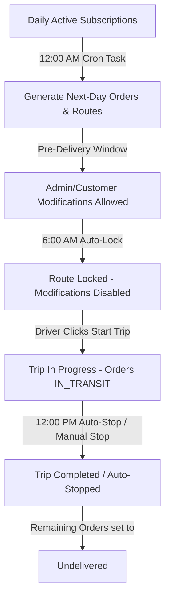

# Pench ERP - Logistics & Trip Lifecycle Management Guide

This document provides a comprehensive guide on how the newly implemented **Logistics, Subscription Delivery, and Trip Lifecycle Management System** operates, including automatic cron runs, manual administrator actions, driver workflows, and how to verify it using either the **React Frontend Console** or **Postman**.


---

## 1. Core Architecture & Workflow

The system is designed with a high-integrity, multi-tenant state machine that manages subscription deliveries and driver routes:



### Key Rules & Thresholds:
1. **12:00 AM Auto-Generation**: Automatic route generation fetches active customer subscriptions, performs date-specific product availability inventory checks, and builds optimal delivery paths via OR-Tools.
2. **6:00 AM Cutoff**: Routes for the day are automatically locked at 6:00 AM. Once locked, admins/customers can no longer modify quantities or delivery stops.
3. **12:00 PM (Noon) Cutoff**: Any route still marked as active or in-progress is automatically stopped. Any order not yet delivered is automatically set to `undelivered` with an audit log reason.

---

## 2. Admin Web Panel Operations

The **Logistics & Fleet** console is fully integrated with these features:

### A. Automatic Route Generation
* **Location:** Header block of the **Logistics & Fleet** page.
* **Actions:**
  * **"Generate Tomorrow's Routes"**: Manually triggers the routing builder to construct optimal routes for tomorrow based on subscription contracts and current inventory.
  * **"Force Regenerate"**: Deletes incomplete routes for the target date and completely reconstructs them.
* **Visual indicator:** Alerts detail how many routes and delivery orders were successfully created.

### B. Locking / Unlocking Routes
* **Location:** **Route Management** tab.
* **Actions:**
  * Click on any route to select it.
  * Click **"Lock Route"** to prevent modifications. A lock icon will appear next to the route name in the list.
  * Click **"Unlock Route"** to re-allow changes (only possible before the trip starts).

---

## 3. Driver App Workflows

For mobile drivers, the workflow is highly streamlined:

### Step 1: Check Active Route
* **Endpoint:** `GET /api/drivers/my-route/`
* **Response:** Returns the active route assigned to the logged-in driver, including the sorted sequence of delivery stops, custom customer pricing details, and the product carrying requirements:
  ```json
  {
    "id": "e4c5d700-085a-4173-b815-64bd019ab7de",
    "name": "Nagpur West - 2026-05-23",
    "status": "pending",
    "is_locked": true,
    "stops": [
      {
        "id": "stop-uuid-1",
        "sequence_number": 1,
        "customer_name": "Alice Smith",
        "address": "123 Green Ave, Nagpur",
        "product_list": [
          { "product_id": "prod-1", "product_name": "1L Water Bottle", "quantity": 2, "unit_price": "20.00" }
        ]
      }
    ]
  }
  ```

### Step 2: Start Trip
* **Endpoint:** `POST /api/erp/orders/driver/{route_id}/start-trip/`
* **Action:** Locks the route automatically, changes route status to `in_progress`, and transitions all stop orders to `in_transit`.

### Step 3: Complete Trip
* **Endpoint:** `POST /api/erp/orders/driver/{route_id}/complete-trip/`
* **Action:** Changes route status to `completed` and transitions any skipped/undelivered stop orders to `undelivered`.

---

## 4. Postman Reference Keys

All APIs can be tested in Postman under the folder **`00. SPECIAL: Driver Mobile App`** and **`07. ERP Logistics / Routes`**:

* **Environment Variable:** Set `city_url` to your active tenant subdomain (e.g., `nagpur.pench.api.polynexus.in`).
* **Variables:** Set `route_id` with your generated route's UUID.
